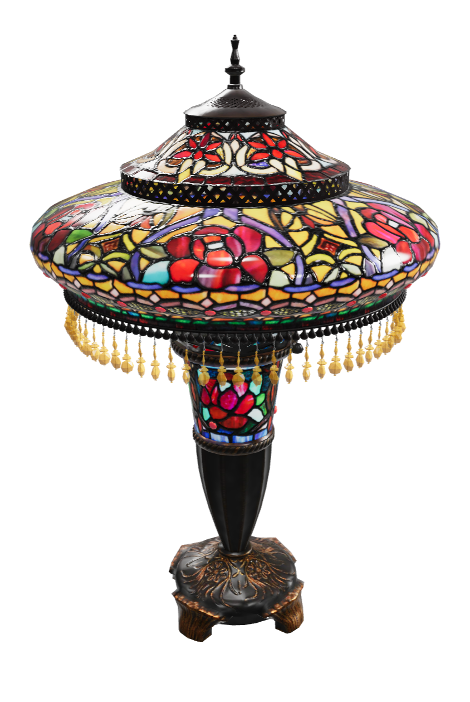

# StainedGlassLamp - KTX2 with high quality

## Screenshot

Above: screenshot from [<model-viewer>](https://modelviewer.dev/examples/tester.html)

## Description

The textures in this model is compressed using KTX2 - a combination of UASTC, mostly for linear textures, and ETCS1, mostly for sRGB textures.
Normal map textures are compressed using higher quality (less postprocessing compression) in order to retain the needed visual fidelity for specular.
RGBA Textures are also compressed using higher quality in order to avoid visual artefacts.

The compression settings that are used can be found in 'compress_hq_normals_rdo.bat'

