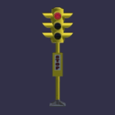
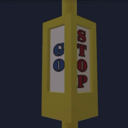

# Traffic Signal

## Purpose

This sample model demonstrates the `KHR_animation_pointer` extension which allows animating most properties of a glTF file, in contrast to "regular" animation which can only animate node transforms and morph target weights. These new capabilities bring glTF on par with other powerful animation systems such as USD, Blender, Unity.  

## Screenshots

## Summary

Traffic signals animating lamp lighting and switching progress/stop flags.

## Extensions Used

* KHR_texture_transform
* KHR_lights_punctual
* KHR_animation_pointer

## Operations

* [Display](https://gltf-viewer-86cef.web.app/?model=./glTF-Binary/TrafficSignal.glb) in SampleViewer
* [Download GLB](./glTF-Binary/TrafficSignal.glb)
* [Model Directory](./)

## Description

List of animated properties found in this sample:

/materials/<ID>/emissiveFactor
/materials/<ID>/pbrMetallicRoughness/baseColorFactor
/extensions/KHR_lights_punctual/lights/<ID>/intensity
/materials/<ID>/pbrMetallicRoughness/baseColorTexture/extensions/KHR_texture_transform/scale
/materials/<ID>/pbrMetallicRoughness/baseColorTexture/extensions/KHR_texture_transform/rotate
/materials/<ID>/pbrMetallicRoughness/baseColorTexture/extensions/KHR_texture_transform/offset

## Animation lamps

Lamp flicker is controlled by the material base color and the emission of the lens object.
The light object is used to represent the shading and the residual heat of the bulb filament.

(above) Material(baseColorFactor, emissiveFactor) animation.

(above) Material(baseColorFactor, emissiveFactor) and Light(Intensity) animation.

## Animation flags

(above) Flag (UV offset, scale) animation.

## Creation Details

The asset was created using [3ds Max](https://www.autodesk.com/products/3ds-max), exported to glTF using [HSglTfExporter](https://nu1963u.wixsite.com/custom3dsmax/gltfpluginfor3dsmax).

## License Information

Satoshi Hayashi CC-BY 4.0 https://creativecommons.org/licenses/by/4.0/ 

